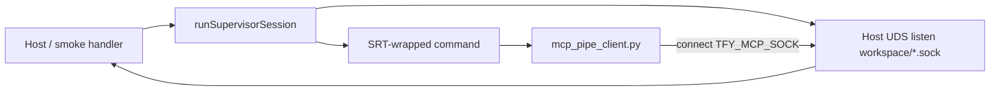
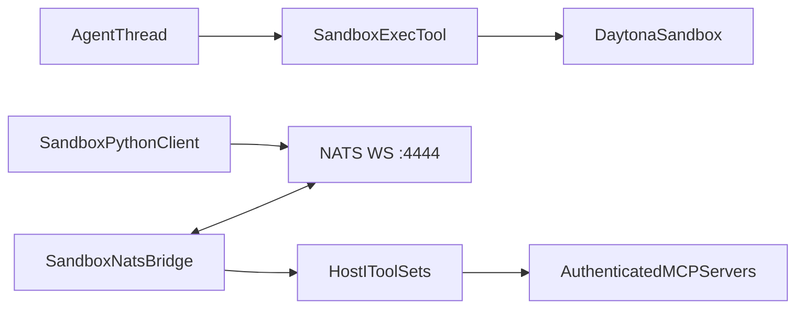
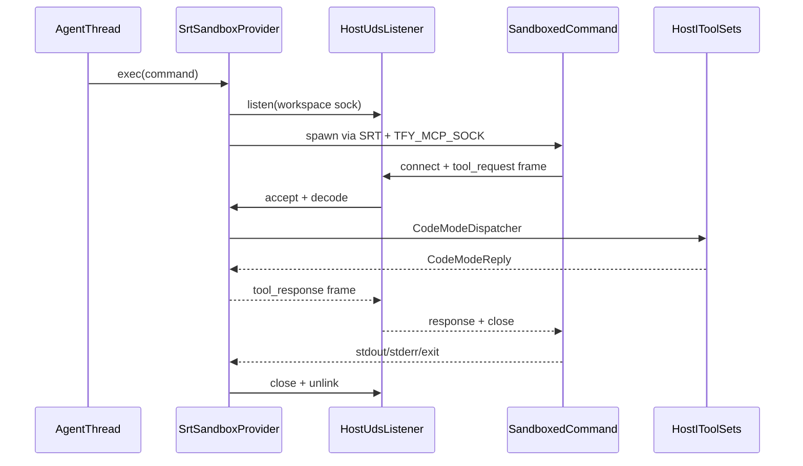

# SRT Standalone Sandbox and Code Mode

## PoC status (`local-sandbox/`) — current ground truth

Standalone TypeScript PoC (not in the pnpm workspace). Scripts: `pnpm smoke`, `pnpm smoke:lima`, `pnpm probe:loopback`.

### Proven

| Area                 | Result                                                                                                                                                                     |
| -------------------- | -------------------------------------------------------------------------------------------------------------------------------------------------------------------------- |
| Provider shape       | `LocalSandboxProvider`: create/exec/upload/download, workspace dirs, TFY-style size/path errors                                                                            |
| Exec model           | Host wraps **only** the untrusted command via `SandboxManager.wrapWithSandboxArgv`; no sandboxed outer supervisor process                                                  |
| Workspace FS         | Deny-by-default reads; workspace-local `HOME`/`TMPDIR`; deny SRT default shared writes (`/tmp/claude`, etc.); cross-sandbox absolute path denied                           |
| Network              | Deny-by-default egress; loopback denied (see probe script)                                                                                                                 |
| Output               | Buffered stdout+stderr capped (`MAX_OUTPUT_BYTES` = 14 MiB)                                                                                                                |
| Process tree         | Timeout kills process group; macOS `setsid`/double-fork can survive `killpg` (known limitation); Linux PID ns stronger                                                     |
| Code Mode IPC        | **Path UDS** listen/accept on host; sock under workspace top level; env `TFY_MCP_SOCK`; 4-byte LE length + JSON; one connect per RPC; multiplex = parallel connects        |
| Client               | `fixtures/mcp_pipe_client.py`: connect → framed req/resp → close; no flock, no fd 3/4                                                                                      |
| macOS AF_UNIX        | `allowAllUnixSockets` does **not** consult `allowRead` for connect. Use `allowUnixSockets: [workspace…]` (session-scoped). Synced at `createWorkspace` / `removeWorkspace` |
| Linux AF_UNIX        | `allowAllUnixSockets: true` required for `socket(AF_UNIX)`; pathname connect still gated by FS `allowRead` (bwrap)                                                         |
| Emulated docker.sock | Host creates `…/run/docker.sock` outside allowlist; host connect OK; sandbox connect fails (mac + Lima)                                                                    |
| Abstract UDS / netns | Linux `--unshare-net`: sandbox `/proc/net/unix` is readable but is the **sandbox** table; host abstract listener absent and unconnectable from inside                      |
| sun_path             | macOS ~104 bytes: bind/connect via basename + chdir when absolute workspace path is too long                                                                               |

### Deferred (PoC)

- Per-exec vs per-sandbox UDS lifecycle (PoC uses per-exec sock today; unlink on exec end)
- Wiring `onToolRequest` through `LocalSandboxProvider.exec` (host-run supports it; provider.exec does not yet pass a dispatcher)
- Windows
- Harness/server integration

### Rejected / superseded for standalone Code Mode

- Inherited fd 3/4 + flock shared-stream multiplexing (PoC replaced with path UDS)
- Sandboxed outer supervisor that owns Code Mode pipes (PoC: host owns UDS; only the command is sandboxed)
- Linux abstract UDS as the Code Mode endpoint (not portable to macOS; unnecessary given path UDS + netns findings)



---

## Current product behavior (harness — unchanged)

- `STANDALONE=true` only changes server persistence and peering: SQLite replaces Postgres and Redis is disabled. It does not provide local sandbox compute ([config.ts](/Users/debajyotichatterjee/work/harness/packages/server/src/config.ts), [main.ts](/Users/debajyotichatterjee/work/harness/packages/server/src/main.ts)).
- The production-like standalone launch is one Node/Hono process serving API and bundled UI, but it is not a native single-file binary: `dist/cli.js` launches `dist/main.js`, with Node, dependencies, migrations, SQLite native code, and frontend assets alongside it ([cli.ts](/Users/debajyotichatterjee/work/harness/packages/server/src/cli.ts), [tsup.config.ts](/Users/debajyotichatterjee/work/harness/packages/server/tsup.config.ts)).
- Sandbox admission still requires a persisted provider, and the server currently supports only Daytona ([sessionResources.ts](/Users/debajyotichatterjee/work/harness/packages/server/src/runtime/sessionResources.ts), [sandboxProvider.ts](/Users/debajyotichatterjee/work/harness/packages/server/src/schemas/sandboxProvider.ts)). `TFYSandboxProvider` exists in core but is not server-wired.
- Code Mode is not a separate executor. The agent calls the sandbox `exec` tool, which runs Python/shell and uses an uploaded `mcp_client.py` to call MCP tools through NATS ([Sandbox.ts](/Users/debajyotichatterjee/work/harness/packages/harness/src/core/sandbox/Sandbox.ts), [mcp_client.py](/Users/debajyotichatterjee/work/harness/packages/harness/src/core/sandbox/scripts/mcp_client.py)).



NATS is sandbox-local, not a standalone-server dependency:

- `nats-server` runs inside the sandbox image under supervisor, with WebSocket port `4444`, no TLS/auth, and a 64 MB payload cap ([sandbox.Dockerfile](/Users/debajyotichatterjee/work/harness/packages/harness/scripts/sandbox/sandbox.Dockerfile), [nats.conf](/Users/debajyotichatterjee/work/harness/packages/harness/scripts/sandbox/nats.conf)).
- The gateway subscribes on a random `sandbox.bridge.<uuid>.mcp` subject through a Daytona signed preview URL ([SandboxNatsBridge.ts](/Users/debajyotichatterjee/work/harness/packages/harness/src/core/sandbox/SandboxNatsBridge.ts), [DaytonaProvider.ts](/Users/debajyotichatterjee/work/harness/packages/harness/src/core/sandbox/provider/DaytonaProvider.ts)).
- MCP credentials remain in the gateway. `ToolSet` still enforces enabled-tool and approval policy. Approval-required, OAuth, client-side, and sub-agent calls are rejected from Code Mode rather than paused; [code-mode.mdx](/Users/debajyotichatterjee/work/harness/docs/context-engineering/code-mode.mdx) currently overstates approval support.
- If the NATS connection cannot be established, normal sandbox execution continues, but MCP calls from Code Mode fail; there is no fallback transport.

## Human review boundary — interfaces before harness implementation

Harness integration should still land contracts before full server wiring. The PoC already locked the **transport choice** (path UDS) and **SRT policy shape**; contracts should reflect that rather than the earlier fd 3/4 design.

Intended ownership:

- `Sandbox` owns which `IToolSet` instances are available to the current agent.
- `CodeModeDispatcher` owns authorization, approval rejection, error classification, tracing, timeouts, and result projection.
- A transport owns framing and lifecycle, but never receives `IToolSet` directly.
- A provider owns sandbox process/filesystem behavior. It may invoke an opaque per-exec dispatcher but does not import MCP implementation types.
- `mcp_client.py` keeps its current Python API and selects a transport from environment supplied by the provider (`nats` vs `uds`).

### 1. Provider contract

Current contract in [Provider.ts](/Users/debajyotichatterjee/work/harness/packages/harness/src/core/sandbox/provider/Provider.ts):

```ts
export interface SandboxExecParams {
  sandboxId: string;
  command: string;
  cwd?: string | undefined;
  env?: Record<string, string> | undefined;
  timeoutSeconds?: number | undefined;
}

export interface SandboxProvider {
  createSandbox(): Promise<{ sandboxId: string }>;
  exec(params: SandboxExecParams): Promise<ExecResult>;
  getAdditionalInstructions(): string | undefined;
  getToolResultDumpDir(sandboxId: string): string;
  getGitCredentialsPath(sandboxId: string): string;
  downloadFile(params: { sandboxId: string; path: string }): Promise<Buffer>;
  uploadFile(params: { sandboxId: string; remotePath: string; content: Buffer }): Promise<void>;
  getNatsBridgeUrl(sandboxId: string): Promise<string>;
}
```

Proposed contract (aligned with PoC; `exec_ipc` means parent-owned path UDS, not pipes):

```ts
export type SandboxCodeModeTransport = 'nats_ws' | 'exec_ipc';

export interface SandboxCodeModeDispatch {
  dispatch(params: {
    request: CodeModeRequest;
    traceCarrier: Readonly<Record<string, string>>;
  }): Promise<CodeModeReply>;
  close(params: { reason: 'exec_completed' | 'exec_timed_out' | 'exec_cancelled' | 'protocol_error' }): void;
}

export interface SandboxExecParams {
  sandboxId: string;
  command: string;
  cwd?: string | undefined;
  env?: Record<string, string> | undefined;
  timeoutSeconds?: number | undefined;
  codeMode?: SandboxCodeModeDispatch | undefined;
}

interface SandboxProviderBase {
  readonly codeModeTransport: SandboxCodeModeTransport;
  createSandbox(): Promise<{ sandboxId: string }>;
  exec(params: SandboxExecParams): Promise<ExecResult>;
  getAdditionalInstructions(): string | undefined;
  getToolResultDumpDir(sandboxId: string): string;
  getGitCredentialsPath(sandboxId: string): string;
  downloadFile(params: { sandboxId: string; path: string }): Promise<Buffer>;
  uploadFile(params: { sandboxId: string; remotePath: string; content: Buffer }): Promise<void>;
}

export interface NatsSandboxProvider extends SandboxProviderBase {
  readonly codeModeTransport: 'nats_ws';
  getNatsBridgeUrl(sandboxId: string): Promise<string>;
}

export interface ExecIpcSandboxProvider extends SandboxProviderBase {
  readonly codeModeTransport: 'exec_ipc';
}

export type SandboxProvider = NatsSandboxProvider | ExecIpcSandboxProvider;
```

Review notes:

- The discriminator removes the NATS-only method from SRT without an optional method, a throwing implementation, or a forwarding shim.
- `codeMode` is an opaque dispatch capability. `SrtSandboxProvider` can invoke it but cannot enumerate or bypass agent tool policy.
- `ExecResult` remains unchanged. PoC aggregates stdout/stderr into `{ exitCode, result }` with a hard buffer cap.
- Do not add `destroySandbox` to this contract in the first change. A local workspace must survive `Sandbox.close()` and later turns that restore `existingSandboxId`; retention/explicit deletion needs a separate lifecycle API.
- PoC helper `destroySandbox` / `dispose` stay test-only until that lifecycle API exists.

### 2. Transport-neutral Code Mode request and dispatcher

Current private contract in [SandboxNatsBridge.ts](/Users/debajyotichatterjee/work/harness/packages/harness/src/core/sandbox/SandboxNatsBridge.ts):

```ts
type BridgeRequest =
  | { op: 'list_tools'; server: string }
  | { op: 'call_tool'; server: string; tool: string; arguments?: Record<string, unknown> };

type BridgeErrorSource = 'gateway' | 'agent' | 'bridge';

type BridgeReply<T> = { ok: true; result: T } | { ok: false; error: string; source: BridgeErrorSource };
```

Move the runtime-validated contract to `packages/harness/src/core/sandbox/codeMode/schemas.ts`. These schemas are the canonical TypeScript owner; all runtime types are named `z.infer` aliases.

```ts
export const CodeModeRequestSchema = z.discriminatedUnion('op', [
  z.object({
    op: z.literal('list_tools'),
    server: z.string().min(1),
  }),
  z.object({
    op: z.literal('call_tool'),
    server: z.string().min(1),
    tool: z.string().min(1),
    arguments: z.record(z.string(), z.unknown()).optional(),
  }),
]);
export type CodeModeRequest = z.infer<typeof CodeModeRequestSchema>;

export const CodeModeErrorSourceSchema = z.enum(['gateway', 'agent', 'bridge']);
export type CodeModeErrorSource = z.infer<typeof CodeModeErrorSourceSchema>;

export const CodeModeReplySchema = z.discriminatedUnion('ok', [
  z.object({ ok: z.literal(true), result: z.unknown() }),
  z.object({
    ok: z.literal(false),
    error: z.string(),
    source: CodeModeErrorSourceSchema,
  }),
]);
export type CodeModeReply = z.infer<typeof CodeModeReplySchema>;
```

Proposed dispatcher in `packages/harness/src/core/sandbox/codeMode/CodeModeDispatcher.ts`:

```ts
export interface CodeModeDispatcherOptions {
  toolSets: ReadonlyMap<string, IToolSet>;
  requestTimeoutMs: number;
  maxRequestBytes: number;
  maxResultBytes: number;
  logger: Logger;
}

export class CodeModeDispatcher implements SandboxCodeModeDispatch {
  constructor(options: CodeModeDispatcherOptions);

  dispatch(params: {
    request: CodeModeRequest;
    traceCarrier: Readonly<Record<string, string>>;
  }): Promise<CodeModeReply>;

  close(params: { reason: 'exec_completed' | 'exec_timed_out' | 'exec_cancelled' | 'protocol_error' }): void;
}
```

The extraction moves `getToolSet`, `handleListTools`, `handleCallTool`, `classifyErrorSource`, OAuth rejection, approval/client-side rejection, and sub-agent rejection out of `SandboxNatsBridge`. `SandboxNatsBridge` remains the Daytona transport and delegates decoded requests to this dispatcher; it must not retain duplicate routing logic.

NATS request/reply already supplies correlation, so `request_id` is not part of `CodeModeRequest`. The UDS envelope owns correlation (`request_id` on the wire frame). Both transports return the same `CodeModeReply`.

### 3. Code Mode host UDS protocol (selected — proven in PoC)

**Selected design:** the host (in-process provider/runtime) listens on a pathname Unix domain socket under the sandbox workspace; the sandboxed command connects per MCP call. There is no fd 3/4 carrier and no app-level flock.

```text
Host (trusted):     listen(workspace/<short>.sock) → accept loop
Sandbox command:    TFY_MCP_SOCK=<path or basename>
Each MCP call:      connect → 4-byte LE length + JSON request → read response → close
Concurrency:        parallel connects (no shared byte stream)
```

Wire frame (same framing as PoC / prior pipe design):

- 4-byte little-endian payload length + UTF-8 JSON
- Max frame 64 MiB before allocation; malformed / oversized frames are terminal for that exec
- Request envelope includes `request_id` plus `CodeModeRequest` fields (`op`, `server`, …)
- Response envelope includes `request_id` plus `CodeModeReply` fields

Environment for the sandboxed command:

```text
TFY_MCP_TRANSPORT=uds
TFY_MCP_SOCK=<absolute-or-basename>
```

PoC currently sets only `TFY_MCP_SOCK`; harness should set an explicit transport discriminator so Daytona NATS and SRT UDS cannot be confused.

Platform constraints (must remain in harness policy compilation):

| Platform | AF_UNIX session policy                                                  | Pathname connect gate                                                                   |
| -------- | ----------------------------------------------------------------------- | --------------------------------------------------------------------------------------- |
| Linux    | `allowAllUnixSockets: true` (seccomp has no path allowlist)             | FS `allowRead` / bwrap (smoke: workspace OK; sibling + emulated `run/docker.sock` fail) |
| macOS    | `allowAllUnixSockets: false` + `allowUnixSockets: [active workspaces…]` | Seatbelt UDS subpath (FS `allowRead` alone is **not** sufficient if allow-all is on)    |

Session vs per-exec: SRT reads Unix-socket policy from **session** config (`initialize` / `updateConfig`), not from `wrapWithSandboxArgv` `customConfig`. macOS workspace allowlist is synced when workspaces are created/removed (PoC: `darwinUnixSocketWorkspaces` set).

Lifecycle (still open):

- PoC: one listen sock **per exec**, unlink when exec ends; basename bind when path exceeds macOS `sun_path`
- Candidate: one sock **per sandbox** for the sandbox lifetime (simpler for concurrent execs in one workspace)
- Do not use one global sock across sandboxes without per-request authz
- Pathname sock file can remain after crash; next bind must pre-unlink
- Same-UID host processes that know the path can connect (ambient endpoint; accepted in same-UID trust model) — smoke documents this

Linux abstract UDS (`\0…`) is **not** the Code Mode endpoint. Smoke proves host abstracts are not visible/connectable from the sandbox netns; residual risk is same-sandbox lateral use only.

### 4. SRT runtime and provider

SRT has process-global initialization and network state. PoC owns this in `initSrt` / `resetSrt` + `LocalSandboxProvider.ensureSrt()`. Harness should keep one process-scoped runtime owner rather than calling `SandboxManager.initialize()` in every provider constructor.

Proposed internal contracts (port from PoC `host-run.ts` / `LocalSandboxProvider.ts`):

```ts
export interface SrtSandboxRuntimeOptions {
  globalConfig: SandboxRuntimeConfig;
  logger: Logger;
}

export class SrtSandboxRuntime {
  static initialize(options: SrtSandboxRuntimeOptions): Promise<SrtSandboxRuntime>;

  exec(params: {
    commandId: string;
    commandText: string;
    workspace: string;
    cwd: string;
    environment: Readonly<Record<string, string>>;
    policy: SandboxPolicy;
    timeoutMs: number;
    stdin?: Buffer | undefined;
    codeMode?: SandboxCodeModeDispatch | undefined;
  }): Promise<ExecResult>;
}

export interface SrtSandboxProviderOptions {
  tenantName: string;
  workspaceRoot: string;
  runtime: SrtSandboxRuntime;
  defaultPolicy: SandboxPolicy;
  defaultExecTimeoutMs: number;
  fileMaxBytesForDownload: number;
  logger: Logger;
}

export class SrtSandboxProvider implements ExecIpcSandboxProvider {
  readonly codeModeTransport = 'exec_ipc';
  constructor(options: SrtSandboxProviderOptions);
}
```

`SrtSandboxRuntime.exec` wraps only the untrusted command argv with `SandboxManager.wrapWithSandboxArgv` (`shell: false`). The host owns the Code Mode UDS server in-process (as in PoC `runSupervisorSession`); it does not spawn a separate sandboxed supervisor for framing.

Canonical policy schema still belongs in `packages/harness/src/core/sandbox/policy/schemas.ts` (unchanged intent: immutable floor + per-sandbox snapshot). `compileSrtConfig` must emit:

- Complete per-exec filesystem config (no shallow merge of SRT array replacements)
- Workspace-local `HOME` / `TMPDIR` / cache paths
- Deny of SRT default shared write paths
- Platform AF_UNIX session policy as in the PoC table above
- Default deny network; no `allowAppleEvents` / weaker isolation flags

Windows remains a release gate: current SRT allows per-exec denies but not per-exec `allowRead`/`allowWrite`. Do not claim concurrent workspace isolation on Windows until `srt-win` gains per-exec grants or another reviewed design proves isolation.

### 5. Server provider manifest and standalone selection

Current provider schema:

```ts
export const SandboxProviderSchema = DaytonaSandboxProviderSchema;
export type SandboxProviderManifest = z.infer<typeof SandboxProviderSchema>;
```

Proposed schema in [sandboxProvider.ts](/Users/debajyotichatterjee/work/harness/packages/server/src/schemas/sandboxProvider.ts):

```ts
export const SrtSandboxProviderSchema = z
  .object({
    type: z.literal('srt'),
    exec_timeout_ms: z.number().int().positive(),
    policy: SandboxPolicySchema.optional(),
  })
  .strict()
  .openapi('SrtSandboxProvider');

export const SandboxProviderSchema = z.discriminatedUnion('type', [
  DaytonaSandboxProviderSchema,
  SrtSandboxProviderSchema,
]);
export type SandboxProviderManifest = z.infer<typeof SandboxProviderSchema>;
```

`SandboxPolicySchema` is imported from its canonical owner rather than duplicated in the server. `workspace_root` is deliberately not accepted over HTTP because it is a host trust-boundary path; it comes only from validated server configuration.

Proposed resolution behavior:

```ts
export async function resolveSandboxProvider(params: {
  tenant_id: string;
  store: ISandboxProviderStore;
  logger: Logger;
  standaloneRuntime?: SrtSandboxRuntime | undefined;
  standaloneDefaults: {
    workspaceRoot: string;
    policy: SandboxPolicy;
    execTimeoutMs: number;
  };
}): Promise<SandboxProvider | undefined>;
```

- `STANDALONE=true`: return SRT even when no provider row exists, using server defaults. An optional persisted `type: 'srt'` row may narrow policy and timeout.
- `STANDALONE=true` plus a persisted Daytona row: fail with an actionable topology error instead of silently contacting a remote provider.
- `STANDALONE=false`: preserve the current no-row result and Daytona construction. Reject a persisted SRT row because SRT belongs to the local process.
- `validateAgentSpec` and the capabilities API treat standalone SRT availability as sandbox availability without requiring `PUT /settings/sandbox-providers`.
- SRT dependency checks fail closed. There is no unsandboxed fallback.

### 6. `Sandbox` before and after

Current [Sandbox.ts](/Users/debajyotichatterjee/work/harness/packages/harness/src/core/sandbox/Sandbox.ts) unconditionally attempts NATS in `handleExec`. Proposed branch:

```ts
const mcpServers = this.buildMcpServersEnvelope();
const commonEnv = buildMcpClientEnv({
  env: input.env,
  execExtraEnv: this.execExtraEnv,
  mcpServers,
});

if (this.provider.codeModeTransport === 'nats_ws') {
  const bridge = await this.ensureNatsBridgeConnected({
    provider: this.provider,
    sandboxId: sandboxInfo.sandbox_id,
  });
  return this.provider.exec({
    sandboxId: sandboxInfo.sandbox_id,
    command: input.command,
    cwd: input.cwd,
    env: buildNatsMcpClientEnv({ commonEnv, bridge, requestTimeoutSeconds }),
  });
}

const dispatcher = this.createCodeModeDispatcher();
try {
  return await this.provider.exec({
    sandboxId: sandboxInfo.sandbox_id,
    command: input.command,
    cwd: input.cwd,
    env: commonEnv,
    codeMode: dispatcher,
  });
} finally {
  dispatcher.close({ reason: 'exec_completed' });
}
```

The SRT provider injects `TFY_MCP_TRANSPORT=uds` and `TFY_MCP_SOCK` itself (not from `Sandbox`). Initialization execs do not receive `codeMode`. Only agent-requested `handleExec` creates an exec-scoped dispatcher.

### 7. `mcp_client.py` before and after

Public surface does not change:

```py
from mcp_client import call_tool
result = await call_tool(server, tool, body={...})
```

```text
mcp-client call-tool <server> <tool> '<json>'
```

Refactor internals behind a private protocol (PoC client is the UDS reference implementation):

```py
class _McpTransport(Protocol):
    async def request(self, payload: dict[str, Any]) -> Any: ...


def _build_transport() -> _McpTransport:
    transport = os.environ.get("TFY_MCP_TRANSPORT", "nats")
    if transport == "uds":
        return _UdsTransport(path=_required_env("TFY_MCP_SOCK"))
    if transport == "nats":
        return _NatsTransport.from_environment()
    raise RuntimeError(f"Unsupported MCP transport: {transport}")
```

- `_NatsTransport`: current Daytona behavior unchanged
- `_UdsTransport`: connect → one framed request/response → close (no flock). Concurrent calls = concurrent connections
- Regenerate the sandbox-script bundle through the existing package script; do not hand-edit generated embeds

### 8. Cancellation boundary

Current local-tool interfaces do not carry an `AbortSignal`. For the first SRT release:

- `timeoutSeconds` is authoritative and kills the sandboxed command process group (PoC: `kill(-pid)`; macOS setsid escape is a known limitation).
- Closing the exec-scoped dispatcher rejects or discards pending UDS replies; host stops listening and unlinks the sock.
- Existing `RemoteMCP` instances retain the turn signal they already receive when constructed.
- Do not claim that an arbitrary local tool can be interrupted mid-handler.

End-to-end turn cancellation for every `IToolSet` remains a separate broad interface change; keep it out of the provider/IPC contract change unless promoted to a release requirement.

## Required code changes by file

### Done in PoC (reference implementation)

- `local-sandbox/src/core/host-run.ts`: workspace lifecycle, SRT init/reset, AF_UNIX session policy, Code Mode UDS listen/accept, process-group kill, curated env
- `local-sandbox/src/provider/LocalSandboxProvider.ts`: provider surface + upload/download via sandboxed I/O
- `local-sandbox/fixtures/mcp_pipe_client.py`: UDS client
- `local-sandbox/scripts/smoke.ts` + `smoke:lima`: isolation, Code Mode, UDS FS/seatbelt gate, emulated docker.sock, Linux abstract netns probe
- `local-sandbox/lima/local-sandbox.yaml`: Lima guest for Linux smoke

### Contract-first harness change

- [Provider.ts](/Users/debajyotichatterjee/work/harness/packages/harness/src/core/sandbox/provider/Provider.ts): transport discriminator, split provider union, optional exec-scoped dispatch capability
- `packages/harness/src/core/sandbox/codeMode/schemas.ts`: canonical request/reply schemas
- `packages/harness/src/core/sandbox/codeMode/CodeModeDispatcher.ts`: extract host dispatch from `SandboxNatsBridge`
- `packages/harness/test/core/sandbox/codeMode/CodeModeDispatcher.test.ts`: disabled tools, OAuth, approvals, client tools, sub-agents, timeout, close, size limits, tracing, error-source

### Daytona compatibility change

- [DaytonaProvider.ts](/Users/debajyotichatterjee/work/harness/packages/harness/src/core/sandbox/provider/DaytonaProvider.ts): `NatsSandboxProvider`, `codeModeTransport = 'nats_ws'`
- [SandboxNatsBridge.ts](/Users/debajyotichatterjee/work/harness/packages/harness/src/core/sandbox/SandboxNatsBridge.ts): retain NATS connection/retry/drain/correlation; validate with `CodeModeRequestSchema`; delegate routing
- [Sandbox.ts](/Users/debajyotichatterjee/work/harness/packages/harness/src/core/sandbox/Sandbox.ts): narrow on `codeModeTransport`; preserve session-scoped NATS for Daytona
- Existing NATS bridge tests: wire compatibility / no drift before SRT lands

### SRT provider, UDS Code Mode, and policy

- Port PoC host-run into `SrtSandboxRuntime` / `SrtSandboxProvider` (no sandboxed outer supervisor)
- `packages/harness/src/core/sandbox/codeMode/udsBridge.ts` (name flexible): host listen/accept, frame codec, correlation, teardown
- [mcp_client.py](/Users/debajyotichatterjee/work/harness/packages/harness/src/core/sandbox/scripts/mcp_client.py): private NATS/UDS split; preserve imports and CLI
- Existing sandbox-script generator: regenerate embedded source via package script
- `packages/harness/src/core/sandbox/policy/schemas.ts` + `compileSrtConfig.ts`: immutable floor, workspace-local paths, platform AF_UNIX session rules from PoC
- `packages/harness/package.json`: production SRT dependency, assets, package scripts (`smoke` / Lima as applicable)
- Provider tests: ownership, persistence, FS isolation, timeout, output limit, UDS protocol abuse, fail-closed deps

### Standalone server change

- [config.ts](/Users/debajyotichatterjee/work/harness/packages/server/src/config.ts): own all `SRT_*` env reads
- [sandboxProvider.ts](/Users/debajyotichatterjee/work/harness/packages/server/src/schemas/sandboxProvider.ts): `daytona | srt` discriminated manifest
- [sessionResources.ts](/Users/debajyotichatterjee/work/harness/packages/server/src/runtime/sessionResources.ts): one SRT runtime, implicit standalone SRT, topology errors
- Capabilities / turns APIs: standalone availability and resolution
- Server tests: no-row standalone, invalid topology, dependency failure, unchanged distributed Daytona

### Generated and consumer synchronization

- Frontend sandbox-provider handling for `srt`, or hide provider editing in standalone while handling the variant exhaustively
- Regenerate OpenAPI/SDK only through existing scripts; do not hand-edit `.github/fern/openapi/openapi.json` or `packages/sdk`
- Keep dist-free host development, root `pnpm smoke`, packed CJS/ESM consumers, Docker Daytona/NATS behavior

## Must ensure

- **Strict workspace isolation:** A sandbox must not read/write another workspace or share writable temp/cache/log storage. PoC denies SRT default shared writes and uses workspace-local `HOME`/`TMPDIR`; concurrent cross-sandbox isolation remains a harness release gate.
- **AF_UNIX policy (from PoC):** Never enable macOS `allowAllUnixSockets` for Code Mode; use `allowUnixSockets` workspace subpaths. On Linux, `allowAllUnixSockets` + deny-by-default FS is required; keep emulated-docker and netns abstract smokes.
- **UDS ambient endpoint:** Same-UID host connect is possible if the path is known; accept under same-UID trust or add authz later. Do not treat path secrecy as auth.
- **Windows parity:** Still disabled until duplex/control, Python carrier, and per-exec workspace grants are proven in SRT.

## Selected runtime — Anthropic Sandbox Runtime

Use [`@anthropic-ai/sandbox-runtime`](/Users/debajyotichatterjee/work/sandbox-runtime/package.json) only when `STANDALONE=true`.

- Initialize the process-scoped SRT manager once; pass per-exec filesystem policy through `wrapWithSandboxArgv`; keep AF_UNIX policy in session config and update it when workspaces are created/destroyed on macOS.
- One app-owned workspace per `sandbox_id`; persistence = files across wrapped commands, not a long-lived shell.
- Keep `allowAppleEvents`, `enableWeakerNetworkIsolation`, `enableWeakerNestedSandbox`, and unrestricted local binding disabled.
- Default to no network. Grant external domains deliberately for Git/package workflows; Code Mode itself uses UDS, not network.

## Code Mode — parent-owned path UDS for every exec

Do not run NATS, expose a TCP listener, or have the sandbox connect back to Harness over the network.



- Host owns listen/accept; only the arbitrary command is SRT-wrapped.
- Code Mode remains Python `mcp_client` / `mcp-client` CLI; shell can invoke the CLI without consuming command stdin/stdout.
- Malformed frames, oversized payloads, and writes after teardown are terminal for that exec.
- Bind channel lifetime to exec or sandbox (lifecycle decision TBD); no reusable credential survives destroy.
- Extract dispatcher from `SandboxNatsBridge`; keep NATS adapter for Daytona.

## Language support

SRT remains language-agnostic for ordinary `exec`. Code Mode remains Python-only for now.

- Reuse `from mcp_client import call_tool` and `mcp-client call-tool …`
- Add UDS transport selected by SRT env; retain NATS for Daytona
- No app-level lock required for UDS (one connection per RPC)
- Preserve timeout and non-idempotent retry semantics; host dispatcher remains authoritative
- JS/TS may run as ordinary sandbox commands when installed; no JS/TS Code Mode client in this plan

## Per-sandbox policy model

- Canonical versioned `SandboxPolicy` owned outside SRT (filesystem, PTY, Git, timeouts/limits, unsafe flags). Network remains standalone-process-global for this phase.
- Store policy snapshot + revision with local sandbox metadata; every exec captures one immutable revision.
- Compile complete SRT config per invocation from immutable floor + snapshot; do not shallow-merge SRT array fields.
- Optimistic updates (`expected_revision`) later; first release may ship revision zero only.
- Windows grants stamped at init remain a blocker for concurrent isolation claims.

## Skills, Git, and files

- Reuse existing skill initialization inside the SRT workspace.
- Isolate Git configuration and credentials; disable hooks/filters/local protocols as planned.
- Uploads/downloads: PoC pattern is host size/dir checks + sandboxed I/O (`python3 -c` / `cat`); port with existing max-bytes validation.
- Every agent `exec` that receives `codeMode` can use Code Mode via `TFY_MCP_SOCK`.

## Standalone wiring and packaging

- Enable SRT backend only for standalone topology; distributed Daytona + sandbox-local NATS unchanged.
- Fail closed with actionable reasons when SRT/helpers unavailable; no unsandboxed fallback.
- Add SRT + Python client assets as production dependencies; preserve static imports and packed CJS/ESM.
- Use package scripts for dependency checks and smokes (port patterns from `local-sandbox/package.json`).

## Recommended rollout

1. **Done (PoC):** macOS + Linux (Lima) workspace isolation, process/output limits, path-UDS Code Mode, AF_UNIX policy smokes (`local-sandbox/`).
2. Decide UDS lifecycle (per-exec vs per-sandbox) and concurrent macOS `allowUnixSockets` sync rules; keep PoC smokes green.
3. Extract shared host `CodeModeDispatcher`; retain NATS as Daytona transport.
4. Land harness provider/policy contracts + port PoC into `SrtSandboxProvider` / `SrtSandboxRuntime`.
5. Adapt production `mcp_client.py` to UDS; regenerate sandbox-script bundle.
6. Wire standalone server selection, skills, Git credentials, uploads, artifacts, persistence.
7. Prototype Windows only after upstream SRT gaps close; keep disabled until duplex/control + per-exec grants + carrier pass.
8. Platform security, concurrency, packed-release, and end-to-end standalone Code Mode checks before enabling each platform.

## Validation gates

- **PoC already covers (keep as harness regression scripts):** workspace FS isolation; env scrubbing; loopback deny; process-group timeout; output cap; Code Mode list-tools / bad frames / multiplex; missing `TFY_MCP_SOCK`; same-UID host UDS connect; workspace UDS OK; outside path UDS fail; host-created emulated `run/docker.sock` deny; Linux host-abstract absent from sandbox `/proc/net/unix` + connect fail; macOS `allowUnixSockets` gate.
- **Still required in harness:** disabled/approval/OAuth/client/sub-agent tool policy via real `CodeModeDispatcher`; concurrent sandboxes with distinct policy revisions; packed CJS/ESM + Docker Daytona/NATS unchanged; standalone SQLite e2e Code Mode; Windows gates when attempted.
- **Release:** preserve dist-free host development, root `pnpm smoke`, npm/npx installs. Add all repeatable checks as `package.json` scripts (no ad hoc CI commands).

## Adjacent corrections

- Fix the Code Mode approval documentation to state that approval-required calls are rejected rather than paused.
- Either wire `network_policy.auth_inject` into `resolvedGitCredentialsContent` or stop advertising it; it is currently schema/documentation without server runtime wiring.
- Use “standalone single-process distribution” rather than “single binary” unless a real native packaging pipeline is added.
